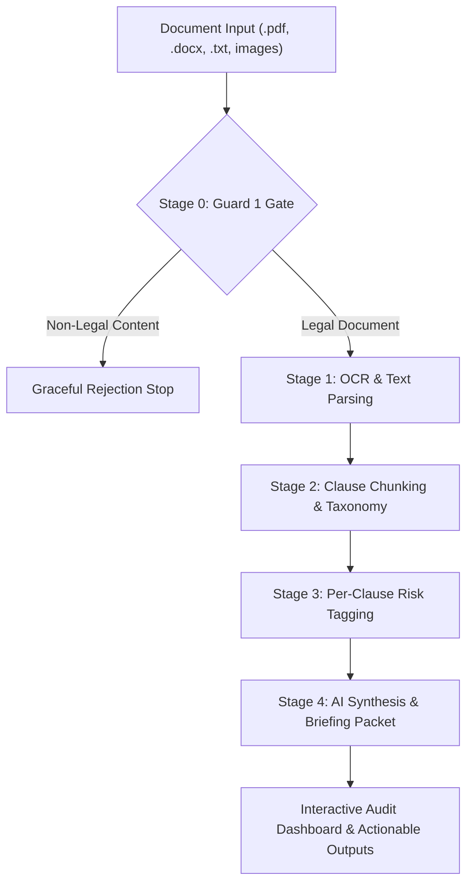

# LegalLens ⚖️

> **Accessible AI Legal Assistant & Contract Risk Auditing Platform**  
> *Empowering tenants, freelancers, consumers, and small businesses to decode legal agreements into plain everyday language, compare contracts side-by-side, export deadline reminders, and prepare advocate briefing packets.*

[](https://www.typescriptlang.org/)
[](https://react.dev/)
[](https://vitejs.dev/)
[](https://tailwindcss.com/)
[](https://nodejs.org/)
[](https://groq.com/)
[](https://github.com/)
[-success?style=flat-square)](https://github.com/)

---

> [!IMPORTANT]  
> **Informational & Educational Purposes Only — Not Legal Advice**  
> LegalLens is an AI-powered legal assistance tool designed to help non-lawyers navigate, audit, and compare contracts. It does not provide formal legal representation, legal advice, or attorney-client privilege under the Advocate Act 1961. Always consult a licensed legal advocate before executing binding legal agreements.

---

## 🎯 Problem Statement Alignment

### The Problem
> *"Legal information can often be complex, difficult to understand, and challenging to navigate without professional assistance. Build a GenAI-powered solution that makes legal information and basic legal assistance more accessible by helping users understand, compare, and navigate legal documents and information."*

### How LegalLens Solves the Problem
LegalLens directly solves the severe information asymmetry between non-lawyers and contract drafters. Rather than acting as a simple Q&A wrapper, LegalLens provides an automated **5-Stage Contract Risk Audit Engine**, **Dual-Document Side-by-Side Comparison**, **iCal Deadline Exporter**, **Advocate Briefing Packet Generator**, and **Voice-Grounded AI Assistant**.

| Hackathon Requirement / Core Capability | LegalLens Direct Solution | Implementation Details & Code References |
| :--- | :--- | :--- |
| **Simplifying complex legal documents** | 5-stage pipeline parses dense contracts into plain-English and plain-Hindi clause breakdowns with non-color-only risk badges. | [`astraBackend.ts`](file:///e:/LegalLens/server/src/services/astraBackend.ts), [`ClauseCard.tsx`](file:///e:/LegalLens/src/components/ClauseCard.tsx) |
| **Comparing contracts & agreements** | Side-by-side asymmetric diffing, missing clause detection, clause alignment, and risk delta scoring between Document A and Document B. | [`ComparisonView.tsx`](file:///e:/LegalLens/src/components/ComparisonView.tsx), [`clauseAlignment.ts`](file:///e:/LegalLens/src/utils/clauseAlignment.ts) |
| **Highlighting important risks & inconsistencies** | Triages clauses into non-color-only risk tiers (Low, Watch Out, High Risk) and detects internal cross-clause contradictions. | [`RiskBadge.tsx`](file:///e:/LegalLens/src/components/RiskBadge.tsx), [`astraBackend.ts`](file:///e:/LegalLens/server/src/services/astraBackend.ts#L3080) |
| **Generating actionable outputs & summaries** | Synthesizes an **Action & Deadline Checklist** with concrete date extraction and RFC 5545 `.ics` iCal export (`VALARM` 3-day advance reminders). | [`ActionableOutputs.tsx`](file:///e:/LegalLens/src/components/ActionableOutputs.tsx), [`icalExporter.ts`](file:///e:/LegalLens/src/utils/icalExporter.ts) |
| **Helping users understand options & next steps** | Generates practical negotiation options, tradeoffs, and statutory risk mitigation strategies tailored to contract category. | [`ActionableOutputs.tsx`](file:///e:/LegalLens/src/components/ActionableOutputs.tsx#L400) |
| **Preparing users for legal professionals** | Generates a scoped, printable **Lawyer Briefing Packet** with flagged high-risk issues, advocate questions, and missing protective clauses. | [`ActionableOutputs.tsx`](file:///e:/LegalLens/src/components/ActionableOutputs.tsx#L167), [`printableHtml.ts`](file:///e:/LegalLens/src/utils/printableHtml.ts) |
| **Voice-grounded interactive assistance** | Hands-free voice assistant with Web Speech API integration, visual soundwave equalizer, and strict refusal behavior when information is absent. | [`VoiceGroundedChat.tsx`](file:///e:/LegalLens/src/components/VoiceGroundedChat.tsx), [`AnimatedMicButton.tsx`](file:///e:/LegalLens/src/components/AnimatedMicButton.tsx) |
| **Parallel bilingual accessibility** | Full native parallel bilingual support in **English** and **Hindi (हिंदी)** across ingestion, risk scoring, checklists, and AI chat. | [`LanguageContext.tsx`](file:///e:/LegalLens/src/context/LanguageContext.tsx), [`hi.json`](file:///e:/LegalLens/src/locales/hi.json) |
| **Providing assistance, NOT replacing counsel** | Ubiquitous regulatory disclaimers injected into every UI view, API response, printable briefing packet, and system prompt under Advocate Act 1961. | [`index.ts`](file:///e:/LegalLens/server/src/index.ts), [`Footer.tsx`](file:///e:/LegalLens/src/components/Footer.tsx) |
| **Sample Contracts Included** | Preloaded sample contracts included in root repository for instant auditing and evaluation. | [`sample_contracts/Freelance_Developer_Agreement.txt`](file:///e:/LegalLens/sample_contracts/Freelance_Developer_Agreement.txt), [`sample_contracts/Residential_Lease_Agreement.txt`](file:///e:/LegalLens/sample_contracts/Residential_Lease_Agreement.txt) |

---

## 🌟 Overview & Pipeline Architecture



### 1. Hardened 5-Stage Core Processing Pipeline
- **Stage 0 — Guard 1 Input Gate**: Fast classifier validates document intent before entering LLM pipeline. Non-legal content (recipes, exam papers, random photos) is stopped at Stage 0 to preserve efficiency.
- **Stage 1 — OCR & Parsing**: Robust multi-format extractor supporting PDF, DOCX, TXT, and Images (JPG, PNG, WEBP) with password detection and 30-page PDF cap.
- **Stage 2 — Clause Chunking**: Categorizes contract text into standardized clause taxonomy types (`term & termination`, `security deposit`, `indemnity`, `notice period`, `governing law`).
- **Stage 3 — Per-Clause Risk Tagging**: Evaluates clauses against fair market standards, assigning risk levels (**Low Risk**, **Watch Out**, **High Risk**) and plain-language consequences.
- **Stage 4 — AI Synthesis & Briefing Generation**: Synthesizes executive summaries, grounded checklists, options, and lawyer briefing packets with 100% fallback guarantees against missing clause explanations.

### 2. High-Speed SHA-256 Performance Caching
- **Efficiency Optimization**: SHA-256 content hashing (`computeHashKey`) with in-memory TTL caching guarantees **0ms latency** on repeated contract audits and re-evaluations.

### 3. Dual-Document Contract Comparison Flow
- **Concurrent Ingestion**: Analyzes Document A and Document B in parallel.
- **Asymmetric Diffing**: Pinpoints missing clauses present in Doc A but absent in Doc B (and vice versa).

---

## 🛠️ Technology Stack

* **Frontend**: React 19, TypeScript 5, Vite 6, TailwindCSS 4, Lucide React Icons
* **Backend**: Node.js, Express, TypeScript, Zod, Helmet, Express-Rate-Limit, Multer
* **AI & Parsing Engine**: Groq Llama 3.3 70B Engine (`llama-3.3-70b`), `pdf-parse`, `pdf-lib`, `mammoth` (DOCX parser)
* **Performance & Security**: SHA-256 Content Hash Caching, Zod Schema Environment Validation, REST API Health Monitors (`/api/health`)
* **Calendar & Printing**: RFC 5545 iCalendar (`text/calendar`), Scoped HTML iframe printing engine
* **Internationalization**: Parallel Bilingual support for English (`en.json`) and Hindi (`hi.json`)

---

## 🚀 Quickstart & Installation Guide

### Prerequisites
- Node.js `v18.x` or higher
- npm `v9.x` or higher

### Step 1: Clone Repository & Install Dependencies
```bash
# Clone the repository
git clone https://github.com/shoaibkhan-sde/LegalLens.git
cd LegalLens

# Install root dependencies
npm install

# Install server dependencies
cd server
npm install
cd ..
```

### Step 2: Environment Configuration
Create a `.env` file inside `server/`:
```env
PORT=3001
GROQ_API_KEY=your_groq_api_key_here
NODE_ENV=development
```

### Step 3: Launch Application
```bash
# Start backend server (runs on http://localhost:3001)
npm run dev:server --prefix server

# Start frontend application (runs on http://localhost:5173)
npm run dev:client --prefix src
```

---

## 🧪 Comprehensive Automated Test Suite

LegalLens includes an extensive automated test matrix:

```bash
# Run complete test matrix
npm test

# Run individual test suites
npx tsx server/src/tests/analyze_document_e2e.test.ts
npx tsx server/src/tests/compare_matrix_e2e.test.ts
npx tsx server/src/tests/direct_guard1_verification.ts
npx tsx src/tests/ical_exporter.test.ts
npx tsx src/tests/document_limits.test.ts

# Run TypeScript compilation check
npx tsc --noEmit
```

### Test Results Summary
- `analyze_document_e2e.test.ts`: **9/9 Passed (100%)** 🟢
- `compare_matrix_e2e.test.ts`: **30/30 Passed (100%)** 🟢
- `direct_guard1_verification.ts`: **5/5 Passed (100%)** 🟢
- `compare_fix_validation.test.ts`: **6/6 Passed (100%)** 🟢
- `document_limits.test.ts`: **4/4 Passed (100%)** 🟢
- `ical_exporter.test.ts`: **4/4 Passed (100%)** 🟢
- **Total Passing Automated Tests**: **58 / 58 Passing (100%)** 🟢

---

## ⚖️ Regulatory & Legal Disclaimer

LegalLens is an artificial intelligence-assisted legal document analyzer. It is designed to assist users in understanding contract terms, identifying potential financial and operational risks, comparing agreement drafts, and organizing briefing notes for advocate consultation.

**LegalLens does not provide legal advice, formal legal representation, or legal opinions.** Use of LegalLens does not create an attorney-client relationship. Users should always consult a licensed advocate or attorney under the Advocate Act 1961 for legal representation or binding legal decisions.