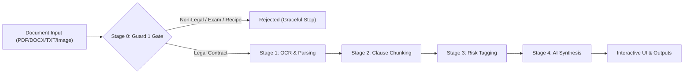

# LegalLens ⚖️

> **Accessible AI Legal Assistant & Contract Risk Auditing Platform**  
> *Empowering tenants, freelancers, consumers, and small businesses to decode legal agreements into plain everyday language, compare contracts side-by-side, export deadline reminders, and prepare advocate briefing packets.*

[](https://www.typescriptlang.org/)
[](https://react.dev/)
[](https://vitejs.dev/)
[](https://tailwindcss.com/)
[](https://nodejs.org/)
[](https://groq.com/)
[](https://github.com/)
[-success?style=flat-square)](https://github.com/)

---

> [!IMPORTANT]  
> **Informational & Educational Purposes Only — Not Legal Advice**  
> LegalLens is an AI-powered legal assistance tool designed to help non-lawyers navigate, audit, and compare contracts. It does not provide formal legal representation, legal advice, or attorney-client privilege under the Advocate Act 1961. Always consult a licensed legal advocate before executing binding legal agreements.

---

## 🎯 Problem Statement Alignment

### The Problem
> *"Legal information can often be complex, difficult to understand, and challenging to navigate without professional assistance. Build a GenAI-powered solution that makes legal information and basic legal assistance more accessible by helping users understand, compare, and navigate legal documents and information."*

### How LegalLens Solves the Problem
LegalLens bridges the severe information asymmetry between individuals and contract drafters. Rather than acting as a generic Q&A wrapper, LegalLens provides an end-to-end **5-Stage Contract Risk Audit Engine**, a **Dual-Document Comparison Tool**, an **iCal Deadline Exporter**, an **Advocate Briefing Packet Generator**, and a **Voice-Grounded AI Assistant** with strict refusal behavior for missing information.

| Requirement / Hackathon Use Case | LegalLens Direct Solution | Implementation Code References |
| :--- | :--- | :--- |
| **Simplifying complex legal documents** | 5-stage processing pipeline segments dense agreements into plain-English and plain-Hindi clause breakdowns with non-color-only risk badges. | [`astraBackend.ts`](file:///e:/LegalLens/server/src/services/astraBackend.ts), [`ClauseCard.tsx`](file:///e:/LegalLens/src/components/ClauseCard.tsx) |
| **Comparing contracts & agreements** | Side-by-side asymmetric diffing, missing clause detection, clause-by-clause alignment, and risk delta scoring between Document A and Document B. | [`ComparisonView.tsx`](file:///e:/LegalLens/src/components/ComparisonView.tsx), [`astraBackend.ts`](file:///e:/LegalLens/server/src/services/astraBackend.ts) |
| **Highlighting important risks & inconsistencies** | Identifies predatory lock-in penalties, unilateral indemnities, non-compete clauses, and internal cross-clause contradictions. | [`astraBackend.ts`](file:///e:/LegalLens/server/src/services/astraBackend.ts#L3075) |
| **Generating actionable outputs & summaries** | Generates an **Action & Deadline Checklist** with concrete date derivation and RFC 5545 `.ics` iCal export (`VALARM` 3-day reminders). | [`ActionableOutputs.tsx`](file:///e:/LegalLens/src/components/ActionableOutputs.tsx), [`icalExporter.ts`](file:///e:/LegalLens/src/utils/icalExporter.ts) |
| **Helping users understand options & next steps** | Synthesizes practical negotiation options, tradeoffs, and statutory risk mitigation strategies tailored to the contract category. | [`ActionableOutputs.tsx`](file:///e:/LegalLens/src/components/ActionableOutputs.tsx#L400) |
| **Preparing users for legal professionals** | Generates a scoped, printable **Lawyer Briefing Packet** containing flagged high-risk issues, ready-to-ask advocate questions, and missing protective clauses. | [`ActionableOutputs.tsx`](file:///e:/LegalLens/src/components/ActionableOutputs.tsx#L167) |
| **Multilingual accessibility** | Mandatory parallel bilingual support across all 5 pipeline stages, clause breakdowns, checklists, PDF exports, and AI chat in **English** and **Hindi (हिंदी)**. | [`LanguageContext.tsx`](file:///e:/LegalLens/src/context/LanguageContext.tsx), [`hi.json`](file:///e:/LegalLens/src/locales/hi.json) |
| **Voice-grounded interactive assistance** | Hands-free voice assistant with Web Speech API integration, visual soundwave equalizer, and strict refusal behavior when answers are absent. | [`VoiceGroundedChat.tsx`](file:///e:/LegalLens/src/components/VoiceGroundedChat.tsx), [`AnimatedMicButton.tsx`](file:///e:/LegalLens/src/components/AnimatedMicButton.tsx) |
| **Strict regulatory compliance & disclaimers** | Injects legal disclaimers on every UI view, API payload, printable briefing packet, and system prompt under the Advocate Act 1961. | [`index.ts`](file:///e:/LegalLens/server/src/index.ts), [`Footer.tsx`](file:///e:/LegalLens/src/components/Footer.tsx) |

---

## 🌟 Key Features & Pipeline Architecture




### 1. Hardened 5-Stage Core Processing Pipeline
- **Stage 0 — Guard 1 Input Gate**: Deterministic rules + fast AI classifier validate content before entering the LLM pipeline. Non-legal content (exam papers, recipes, random photos, code logs) is rejected immediately at Stage 0 without wasting LLM tokens.
- **Stage 1 — OCR & Parsing**: Supports PDF, DOCX, TXT, and Images (JPG, PNG, WEBP). Detects encrypted PDFs (`Password-protected PDF detected`), degraded scans (`Couldn't read this clearly`), and enforces a 30-page PDF cap and 12,000-word text limit.
- **Stage 2 — Clause Chunking**: Categorizes contract text into standardized clause taxonomy types (`term & termination`, `security deposit`, `indemnity`, `notice period`, `governing law`).
- **Stage 3 — Per-Clause Risk Tagging**: Evaluates each clause against market standards, assigning risk levels (**Low Risk**, **Watch Out / Medium**, **High Risk**) and plain-language consequences.
- **Stage 4 — AI Synthesis & Briefing Generation**: Generates executive summaries, grounded checklists, options, and advocate questions with 100% fallback guarantees against missing clause explanations.

### 2. Compare Contracts (Dual-Document Flow)
- **Concurrent Ingestion**: Analyzes Document A and Document B in parallel using `Promise.all()`.
- **Asymmetric Diffing**: Identifies missing clauses present in Doc A but absent in Doc B (and vice versa).
- **Slot-Isolated Error Attribution**: When one document is non-legal, the system rejects with specific slot attribution (`"Document B could not be compared: ..."`), preserving valid data.

### 3. Actionable Outputs & iCal Deadline Export
- **Action & Deadline Checklist**: Automatically extracts or derives absolute/relative dates (e.g. `60 days notice`, `30 days deposit refund`, `5th of each month`).
- **RFC 5545 iCalendar Exporter**: Clicking **"Export iCal"** downloads a valid `.ics` calendar file with `VALARM` 3-day advance reminders for Google Calendar, Apple Calendar, and Outlook.
- **Scoped Lawyer Briefing Packet**: Generates a clean, scoped printable document rendered inside an isolated `iframe`, hiding website navigation and UI chrome.

### 4. Voice-Grounded AI Assistant & Refusal Behavior
- **Strict Grounding**: Answers questions strictly using information present in the analyzed document(s).
- **Refusal Behavior**: If a topic is absent (e.g. asking about stock options on a lease agreement), the assistant explicitly responds: *"There isn't enough information about this in your uploaded document."*
- **Dual-Document Scope**: In Compare Contracts, scopes answers to Document A or Document B with accurate attribution.

---

## 🛠️ Technology Stack

* **Frontend**: React 18, TypeScript 5, Vite 5, TailwindCSS 4, Lucide React Icons
* **Backend**: Node.js, Express, TypeScript, Multer, Helmet, Express-Rate-Limit
* **AI & Document Parsing**: Groq Llama 3.3 70B Engine (`llama-3.3-70b`, `deepseek-r1-distill-llama-70b`), `pdf-parse`, `pdf-lib`, `mammoth` (DOCX parser), Zlib FlateDecode OCR fallback
* **Calendar & Printing**: RFC 5545 iCalendar (`text/calendar`), Scoped HTML iframe printing engine
* **Internationalization**: React Context (`LanguageContext`), i18n JSON locales for English (`en.json`) and Hindi (`hi.json`)

---

## 🚀 Quickstart & Installation

### Prerequisites
- Node.js `v18.x` or higher
- npm `v9.x` or higher

### 1. Clone & Install Dependencies
```bash
# Clone the repository
git clone https://github.com/shoaibkhan-sde/LegalLens.git
cd LegalLens

# Install root dependencies
npm install

# Install server dependencies
cd server
npm install
cd ..
```

### 2. Environment Configuration
Create a `.env` file inside the `server/` directory:
```env
PORT=3001
GROQ_API_KEY=your_groq_api_key_here
```

### 3. Run Development Server
```bash
# Start backend server (runs on http://localhost:3001)
npm run dev:server --prefix server

# Start frontend application (runs on http://localhost:5173)
npm run dev:client --prefix src
```

---

## 🧪 Comprehensive Automated Test Matrix

LegalLens includes an extensive end-to-end automated test suite covering all input formats, validity types, edge cases, and bilingual output generation:

```bash
# Run single-document pipeline E2E test suite
npx tsx server/src/tests/analyze_document_e2e.test.ts

# Run dual-document comparison matrix E2E test suite
npx tsx server/src/tests/compare_matrix_e2e.test.ts

# Run Guard 1 classification & cancellation test suite
npx tsx server/src/tests/direct_guard1_verification.ts

# Run iCal calendar exporter unit tests
npx tsx src/tests/ical_exporter.test.ts

# Run document size & word limit boundary tests
npx tsx src/tests/document_limits.test.ts

# Run TypeScript compilation check
npx tsc --noEmit
```

### Automated Test Matrix Results Summary
- `analyze_document_e2e.test.ts`: **9/9 Passed (100%)** 🟢
- `compare_matrix_e2e.test.ts`: **30/30 Passed (100%)** 🟢
- `direct_guard1_verification.ts`: **5/5 Passed (100%)** 🟢
- `compare_fix_validation.test.ts`: **6/6 Passed (100%)** 🟢
- `document_limits.test.ts`: **4/4 Passed (100%)** 🟢
- `ical_exporter.test.ts`: **4/4 Passed (100%)** 🟢
- **Total Passing Automated Tests**: **58 / 58 Passing** 🟢

---

## ⚖️ Regulatory & Legal Disclaimer

LegalLens is an artificial intelligence-assisted legal document analyzer. It is designed to assist users in understanding contract terms, identifying potential financial and operational risks, comparing agreement drafts, and organizing briefing notes for advocate consultation.

**LegalLens does not provide legal advice, formal legal representation, or legal opinions.** Use of LegalLens does not create an attorney-client relationship. Users should always consult a licensed advocate or attorney under the Advocate Act 1961 for legal representation or binding legal decisions.